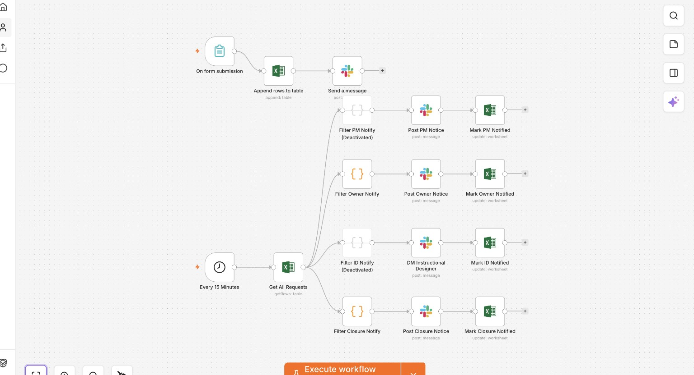

# Enablement Intake Automation

**Structured request capture, shared tracking, and lifecycle notifications.**

Requests arrived through disconnected messages and emails with inconsistent context. I built a single intake workflow that writes requests into a shared tracker and posts a triage notification. A scheduled path detects owner assignment and closure changes made by people in the tracker.

## What I built

- A structured form with text, choice, checkbox, and date inputs.
- Automatic tracker writes with request ID, creation metadata, state, and notification flags.
- Immediate Slack notification after the tracker append.
- A 15-minute poll with four independent notification branches.
- Owner and closure branches enabled; designer and project-manager branches deliberately disabled in the documented rollout.
- Operating guidance for triage, assignment, maintenance, and troubleshooting.

This is deterministic automation. An LLM would add little value to the core capture, filtering, and notification path.

## Engineering judgement

The most useful debugging work was tracing repeated notifications to missing item lineage in filter outputs. Preserving pairedItem links allowed downstream tracker updates to resolve the correct source request. I also corrected stale field mappings and used the existing submission path for individually processed imports rather than maintaining a separate notification implementation.

Notification flags suppress routine repeats. They do not guarantee exactly-once delivery: a message can send successfully while its flag update fails. See the architecture for failure and concurrency limits.

## Workflow screenshot

This user-supplied screenshot belongs to Enablement Intake. It shows the submission path and scheduled notification branches, including the paused designer and PM filters. It is structural evidence, not proof of runtime behavior.

## Evidence and scope

Source documentation reports deployment and end-to-end submission checks. The live system was not inspected for this portfolio. No throughput, hours-saved, or ROI measurements were supplied.

The architecture calls the form 19 fields, while the supplied field table enumerates 18. Without a JSON export the exact count cannot be reconciled, so no headline field-count claim is made.

[Design](docs/DESIGN.md) · [Architecture](docs/ARCHITECTURE.md) · [Implementation](docs/IMPLEMENTATION.md) · [Decisions](docs/DECISIONS.md) · [SOP](docs/SOP.md) · [Validation](docs/VALIDATION.md)

[Back to portfolio](../../README.md)
