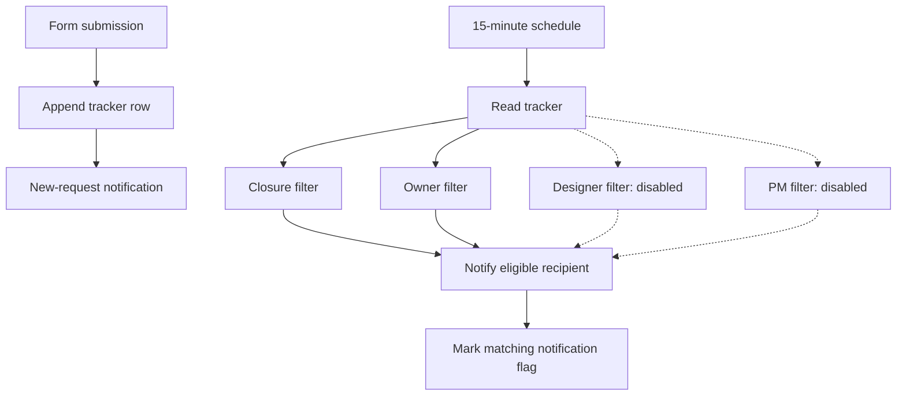

# Architecture

The notify and mark steps above represent a separate pair in each branch, not one shared production node. Excel on SharePoint is the system of record; Slack is a notification surface.

## Eligibility

| Branch | Conditions | Documented rollout |
|---|---|---|
| Closure | Terminal status and Closure Notified = No | Enabled |
| Owner | Assigned owner maps to a recipient and Owner Notified = No | Enabled |
| Designer | Assigned designer and ID Notified = No | Disabled |
| PM | Assigned project manager and PM Notified = No | Disabled |

## Reliability limits

A successful message followed by a failed flag update causes a duplicate on a later poll. Overlapping polls can read the same unmarked row. Flags are useful suppression state, not a transaction or an exactly-once guarantee. Use reconciliation and, at larger scale, durable delivery state and concurrency controls.

Reassignment requires resetting the owner's notification flag in the original design. Exact name matching can silently miss recipients. Prefer stable identity keys and alert on unresolved mappings. Full-table polling scales poorly and is subject to API limits.

A node being disabled does not itself prove its branch is blocked. Verify actual disabled-node semantics and downstream behavior using the exported workflow and execution evidence before enabling or relying on a rollout boundary.
