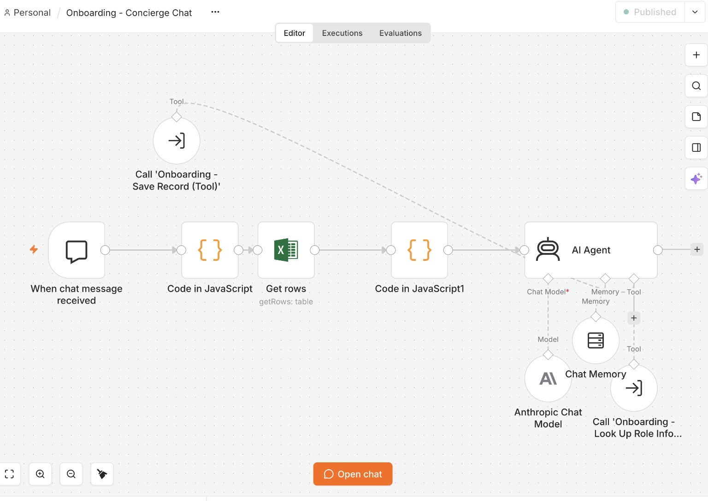
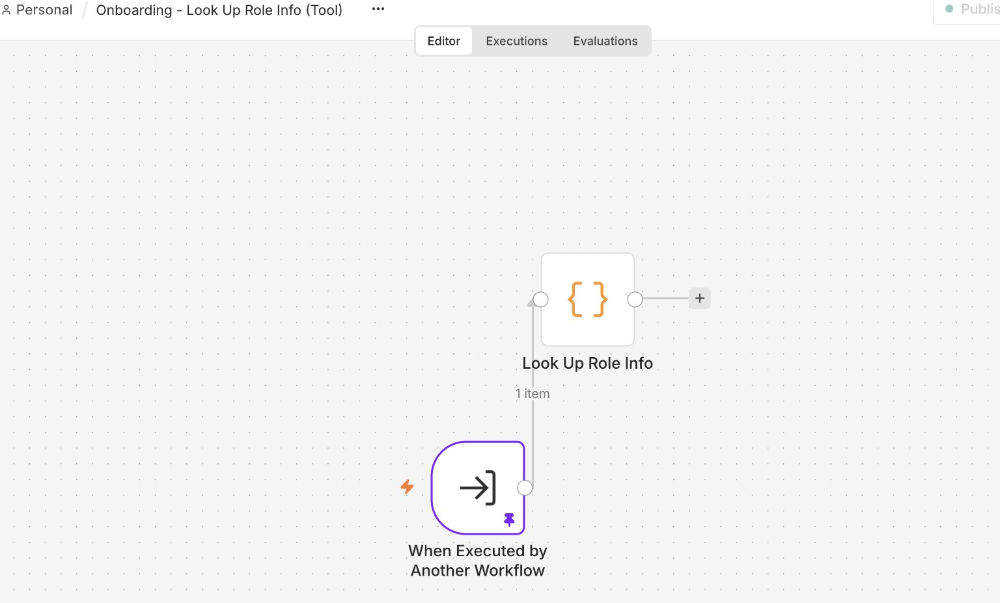
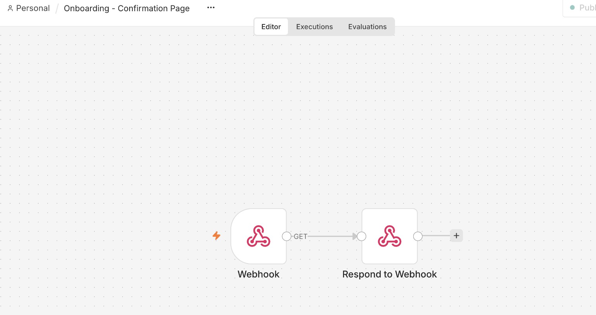

# Onboarding Concierge

**Conversational onboarding requirements capture. Internal proof of concept.**

Hiring managers often provide incomplete onboarding requirements, creating repeated follow-up and manual record compilation. I built a two-stage experience: a short intake form establishes context, then an AI agent collects role-specific needs one question at a time and saves a structured record.

## What I built

Five n8n workflows separate intake, confirmation UI, conversational orchestration, role lookup, and record persistence. The agent combines tracker context, bounded conversation memory, editable role guidance, and two callable tools. Excel on SharePoint holds one record per request.

| Component | Responsibility |
|---|---|
| Intake | Capture six visible fields; generate an authoritative record ID; create a pending record |
| Confirmation page | Load the embedded chat widget and pass request metadata |
| Concierge chat | Resolve context, ask follow-up questions, and invoke tools |
| Role lookup | Match a small role catalogue with keyword rules |
| Save record | Resolve the row and write operational fields and completion status |

## Engineering decisions

- Used editable role guidance and keyword lookup because the small catalogue did not justify a vector database.
- Switched from Sonnet to Haiku after simplifying the prompt and retesting the conversation flow. No quantitative cost or latency comparison was supplied.
- Preserved original chat input during context enrichment to avoid losing the user's message.
- Traced record ID propagation across form, redirect, widget metadata, context lookup, and persistence.
- Added an in-memory storage shim to address the embedded widget's storage failure. Reload continuity remains limited.

## Evidence and limitations

The build log reports four end-to-end conversations, checks across four role categories, and a retest after the model change. Execution logs and a quantitative evaluation dataset are not included.

**The POC is not production ready.** Authentication, enforced session-to-record binding, robust write acknowledgements, and automated error alerts remain gaps. A fallback to the latest pending record can select another user's request. It must be removed before concurrent use; a missing or invalid ID should stop the write.

## Workflow screenshots

### Concierge chat

### Role lookup tool

### Confirmation page

These three user-supplied screenshots show the concierge canvas structure. Intake and save-record canvases were not supplied. Screenshots are not proof of runtime correctness.

## Explore

[Design and data model](docs/DESIGN.md) · [Architecture](docs/ARCHITECTURE.md) · [Implementation guide](docs/IMPLEMENTATION.md) · [Decisions and debugging](docs/DECISIONS.md) · [Operating procedure](docs/SOP.md) · [Validation plan](docs/VALIDATION.md)

[Back to portfolio](../../README.md)
