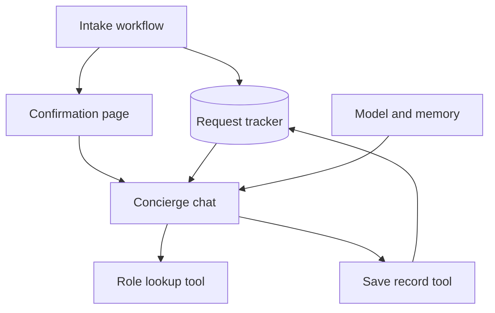

# Architecture

## Contracts

| Boundary | Input | Output |
|---|---|---|
| Intake to confirmation | Authoritative record ID and display context | Embedded chat initialized |
| Widget to chat | Chat input, session context, record ID metadata | Contextual response |
| Chat to role lookup | Role text | Guidance or explicit no-match response |
| Chat to persistence | Record ID and confirmed operational fields | Tracker update result |

Record IDs identify requests. Session IDs identify conversations. Neither should be inferred from whichever tracker row happens to be newest.

## Existing risk

Both the context lookup and save tool historically fall back to the latest pending record when matching fails. This improves a single-user demo's continuity but is unsafe with concurrent requests. Prompt instructions cannot enforce isolation. Replace the fallback with an explicit error and authenticate the record/session binding before exposing the workflow.

The memory window described in the build notes is 20 turns. Do not treat conversational memory as authoritative storage or an access control boundary.
